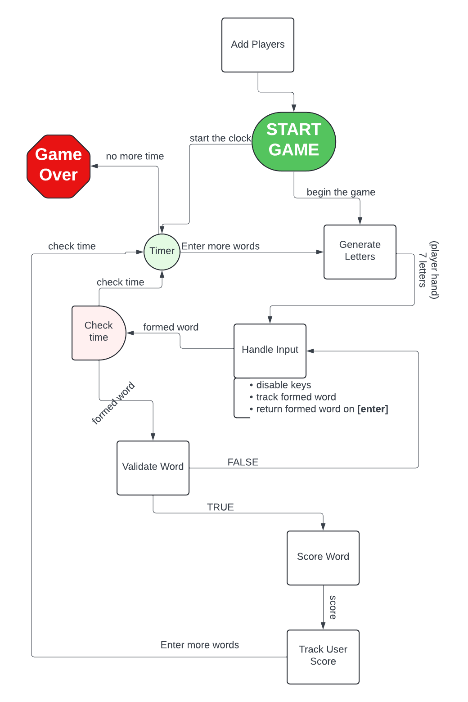
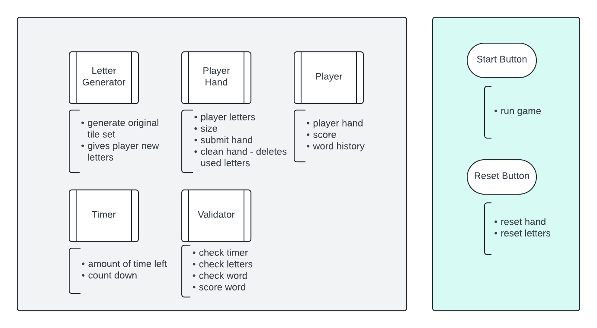

# Project README
### [Google sheets tracking](https://docs.google.com/spreadsheets/d/1deUNmX3e9dHAxLaaXDsRY5MYcDtu5b-gI8qKmDXvWy0/edit?usp=sharing)
## ZAGGLE GAME DIAGRAM


## Frontend
### Getting Started with PixiJS

To get started with PixiJS, refer to the [PixiJS Getting Started Guide](https://pixijs.com/8.x/guides/basics/getting-started).

### Installation and Setup

1. **Install Http-server**  
   Run the following command to install `http-server` globally:
   ```bash
   npm install -g http-server
   ```

2. **Navigate to the Frontend Directory**  
   Once in the frontend directory, start the server with:
   ```bash
   http-server -p 8000
   ```

## Backend

### Python Backend Setup

Please follow these steps to set up the Python backend using a virtual environment:

1. **Clone the Repository**
   ```bash
   git clone <repo>
   ```

2. **Navigate to the Repository Directory**
   ```bash
   cd <repo>
   ```

3. **Install Virtualenv** (if not already installed)
   ```bash
   pip install virtualenv
   ```

4. **Create a New Virtual Environment**  
   Create a new environment named `venv`:
   ```bash
   virtualenv venv
   ```

5. **Activate the Virtual Environment**  
   - **Windows**:
     ```bash
     venv\Scripts\activate
     ```
   - **Linux**:
     ```bash
     source ./venv/bin/activate
     ```

6. **Install Requirements**  
   Install the necessary packages from `requirements.txt`:
   ```bash
   pip install -r requirements.txt
   ```
7. **Capture New Requirements**
8. ```
   pip freeze > requirements.txt
   ```

### Managing the Python Environment

- **Save New Dependencies**  
  Periodically update the `requirements.txt` file if new Python packages are added:
  ```bash
  pip3 freeze > requirements.txt
  ```

### Special Notes

- **Using a Virtual Environment in VSCode**  
  Ensure that VSCode is using the virtual environment as your Python interpreter. To do this, click on the Python interpreter in the bottom bar and select the virtual environment from the list of available interpreters.

### Why Use Virtual Environments?

Python virtual environments allow developers to control software dependencies in Python code. They ensure that the correct package/library versions are consistently used every time the software runs, providing a reliable and reproducible development environment.


## Deployment Inside Digital Ocean Tips
## SSH CLI COMMANDS
```sh
ssh root@zaggle.io
```
- then enter the password (ask @tmcgraw13)
## SSH Key Setup

Follow these steps to ensure your SSH agent is running, your key is added, and the connection is verified.

### 1. Start the SSH Agent

First, ensure the SSH agent is running with the following command:

```sh
eval "$(ssh-agent -s)"
```

### 2. Add Your SSH Key to the Agent

Once the SSH agent is running, add your SSH key:

```sh
ssh-add ~/.ssh/id_rsa
```

### 3. Verify the SSH Key

Check if your SSH key is added successfully:

```sh
ssh-add -l
```

This command should list your SSH keys that are currently loaded by the agent.

### 4. Debugging SSH Agent Connection

If you are still encountering issues, it could be due to the SSH agent not being available in your current shell session. Follow these steps to troubleshoot and ensure the SSH agent is properly configured:

#### Reconfigure the Shell

Sometimes, reconfiguring the shell can resolve issues with the SSH agent connection:

```sh
exec ssh-agent bash
```

After running this command, add your SSH key again:

```sh
ssh-add ~/.ssh/id_rsa
```


### Running Docker Compose with Profiles

#### For Development

```bash
docker-compose --profile dev up --build
```

#### For Production

```bash
NODE_ENV=production docker-compose --profile prod up --build
```
